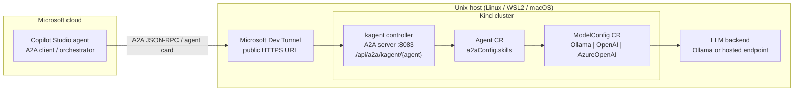

# Implementation Plan: Copilot Studio ⇄ kagent A2A Demo

> **Docker Desktop + WSL2 networking:** the IPv4-only NAT gotcha (stock dual-stack Ollama is unreachable from Kind pods) is resolved by binding Ollama to IPv4 in `20-ollama-up.sh`. See [`docs/troubleshooting.md`](docs/troubleshooting.md) for the full explanation and fix.

## Problem Statement

Demonstrate that a **Microsoft Copilot Studio agent** can communicate with a **kagent-based agent** over the **A2A (Agent-to-Agent) protocol**. Copilot Studio acts as the cloud **A2A client/orchestrator**; a kagent agent running in Kubernetes acts as the local **A2A server**. The kagent endpoint is exposed to the cloud through **Microsoft Dev Tunnels**.

The kagent agent is powered by a **pluggable LLM backend**: the demo starts with a small local model on Ollama, but the backend is configurable to any OpenAI-compatible endpoint (for example Microsoft / Azure AI Foundry) by changing config only.

## Validated Assumptions

| # | Assumption | Status | Note |
|---|------------|--------|------|
| 1 | kagent natively exposes agents over A2A | ✅ Validated | A2A endpoint on controller port `8083`, path `/api/a2a/{namespace}/{agent}` |
| 2 | kagent supports pluggable LLM providers | ✅ Validated | `ModelConfig` supports Ollama, OpenAI, AzureOpenAI, Anthropic, Gemini |
| 3 | kagent installs via Helm OCI chart + CRDs | ✅ Validated | `oci://ghcr.io/kagent-dev/kagent/helm/kagent` and CRDs chart |
| 4 | Copilot Studio is the A2A client/orchestrator | ✅ Validated | Host agent deployed/published via `pac`; the A2A bind itself is a manual maker-portal step |
| 5 | Local kagent can be exposed to cloud clients | ✅ Validated | Persistent anonymous Dev Tunnel forwards the A2A NodePort over HTTPS |
| 6 | A2A bind is `pac`-scriptable | ❌ Refuted | `pac` 2.8.1 has no command to bind an A2A agent; the bind (Agents → Add agent → A2A agent) is a one-time **manual** maker-portal step. `pac` only scripts the host-agent + custom connector deploy. |
| 7 | Host agent must be Published before testing | ✅ Validated | Unpublished agent throws `SystemError`; `60-copilot-deploy.sh` publishes |
| 8 | Copilot Studio accepts the kagent agent card | ⚠️ Conditional | Only the **v0.3** card is accepted; kagent ≥ 0.9.7 emits a v1 `supportedInterfaces` entry that "Add agent → A2A agent" rejects. `40-kagent-install.sh` pins `KAGENT_VERSION=0.9.6` (last pure-v0.3 card) |

## Environment Decisions

- **Dev env:** Unix-like host — Linux, WSL2, or macOS. Native Windows (non-WSL) is out of scope.
- **LLM backend:** pluggable. Default = local Ollama; hosted OpenAI-compatible endpoints are supported via `.env`.
- **Kubernetes:** Kind hosts kagent.
- **A2A direction:** Copilot Studio agent → kagent agent.
- **Tunnel:** Microsoft Dev Tunnels exposes the local kagent A2A endpoint to Copilot Studio.

## Architecture



> Copilot Studio never talks to the LLM directly. All inference happens inside the kagent agent through its `ModelConfig`.

## Repository Layout

```text
kagent-copilot/
├── Makefile
├── README.md
├── .env.example
├── scripts/
│   ├── lib.sh
│   ├── 00-preflight.sh            # + devtunnel/pac + login checks
│   ├── 10-install-tools.sh       # + devtunnel, pac installers
│   ├── 20-ollama-up.sh
│   ├── 25-devtunnel-up.sh        # NEW: persistent Dev Tunnel, resolves TUNNEL_URL
│   ├── 30-kind-up.sh
│   ├── 35-llm-config.sh
│   ├── 40-kagent-install.sh      # a2aBaseUrl = TUNNEL_URL
│   ├── 50-kagent-agent-apply.sh
│   ├── 55-verify-a2a.sh          # local + tunnel passes
│   ├── 60-copilot-deploy.sh      # NEW: deploy + publish host agent + connector (pac)
│   ├── 95-open-ui.sh             # `make demo`: kagent UI + Copilot Studio maker portal + bind steps
│   ├── 97-logs.sh                # kagent | agent | tunnel
│   ├── 98-status.sh              # + Dev Tunnel + Power Platform auth
│   └── 99-teardown.sh            # + tunnel host stop, --copilot, --delete-tunnel, --all
├── kind/
│   └── cluster.yaml
├── kagent/
│   └── agent.yaml                # system message references Copilot Studio
├── copilot/                      # NEW: Copilot Studio host-agent + A2A connector templates
│   ├── agent/instructions.md
│   ├── connector/apiDefinition.json
│   ├── connector/apiProperties.json
│   └── README.md
└── docs/
    └── troubleshooting.md
```

## Implementation Tasks

1. [x] **scaffold** — established the `kagent-copilot` project layout (cluster, env vars, docs) with stable `AGENT_NAME` and namespaces.
2. [x] **dev-tunnel** — `25-devtunnel-up.sh`: persistent anonymous Dev Tunnel, port forward, URL resolution into `TUNNEL_URL`; tools/preflight extended for `devtunnel`/`pac`.
3. [x] **kagent wiring** — `40-kagent-install.sh` advertises the tunnel URL as `controller.a2aBaseUrl`; `55-verify-a2a.sh` checks the public tunnel path.
4. [x] **copilot-deploy** — `60-copilot-deploy.sh` deploys + publishes the host agent and A2A connector via `pac`; `copilot/` holds the committed templates.
5. [x] **manual verification** — `make demo` (`95-open-ui.sh`) opens the kagent UI + maker portal and prints the one-time A2A bind steps; verify by sending the prompt in the Copilot Studio Test pane and watching kagent logs.
6. [x] **teardown** — `99-teardown.sh` stops the tunnel host and (behind flags) deletes the Copilot Studio solution/connection and the tunnel.
7. [x] **docs** — README, this plan, `docs/troubleshooting.md`, and `copilot/README.md` rewritten around the Copilot Studio cloud client.

## Key Risks & Mitigations

- **Tunnel URL drift:** generated dev-tunnel URLs must be propagated to Copilot Studio config. Mitigated — `55-verify-a2a.sh` validates the agent card through the public tunnel URL.
- **kagent agent-card version:** Copilot Studio only accepts a **v0.3** A2A card; kagent ≥ 0.9.7 advertises a v1 interface that the maker portal rejects on bind. Mitigated — `40-kagent-install.sh` pins `KAGENT_VERSION=0.9.6`; bump only after confirming Copilot Studio supports the newer card.
- **Tiny local models:** default `qwen2.5:1.5b` is convenient but hosted OpenAI-compatible backends are more reliable for demos.
- **Cross-platform networking:** `35-llm-config.sh` probes pod-to-host reachability rather than assuming a fixed host address.
- **Idempotency:** scripts should be safe to re-run and fail fast with actionable guidance.

## Out of Scope

- Production ingress/TLS and multi-node Kubernetes hardening.
- Reverse kagent → Copilot Studio callbacks.
